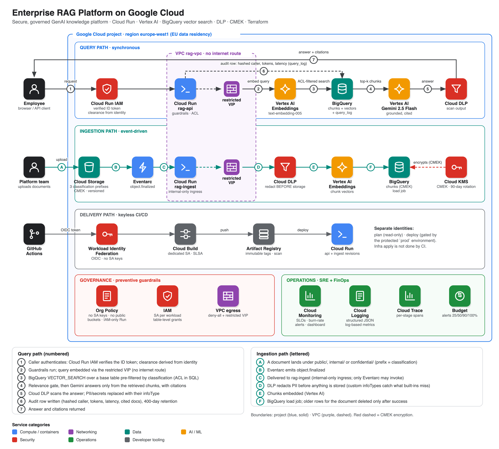

# Architecture

## Context

Click for the vector version. Numbered steps trace the request path, lettered steps trace delivery; the legend under the diagram explains each one. Diagram source: [`docs/diagrams/architecture.py`](diagrams/architecture.py).

## Request lifecycle (query path)

| # | Step | Where | Failure mode handled |
|---|------|-------|----------------------|
| 1 | Authenticate | Cloud Run IAM (`run.invoker`) | Unauthenticated → 403 before any code runs |
| 2 | Input guardrails | `api/guardrails.py` | Injection patterns, empty/oversized input → `blocked:*` (no model call, no cost) |
| 3 | Resolve clearance | `api/access.py` | Unknown identity → `public` (fail closed) |
| 4 | Embed query | Vertex `text-embedding-005` | – |
| 5 | ACL-filtered vector search | BigQuery `VECTOR_SEARCH` over a pre-filtered base table | Chunks above the caller's clearance are never scored or returned |
| 6 | Relevance gate | `max_distance` | Weak matches → `no_relevant_context`, model not called |
| 7 | Grounded generation | Gemini, JSON schema, temp 0.1, no tools | Retrieved text fenced as untrusted data; `answerable=false` path |
| 8 | Output DLP | Cloud DLP | Any PII/secret the model emits is replaced with its infoType |
| 9 | Audit | BigQuery `query_log` (partitioned, 400d) | Best-effort: never fails the request |

## Data flow (ingestion)

1. A file lands in `gs://…-rag-docs/<classification>/…`. The **top-level prefix is the classification**.
2. Eventarc delivers `object.finalized` to `rag-ingest` (ingress is internal-only; the only invoker is the Eventarc SA).
3. Text extracted → **DLP redaction before anything is stored** → heading-aware chunking → embeddings → BigQuery load job.
4. Idempotent: re-delivery deletes then reloads that document's rows.

## Trust boundaries

1. **Internet ↔ Cloud Run** — IAM-authenticated; `run.managed.requireInvokerIam` org policy prevents `allUsers`.
2. **Workload ↔ Google APIs** — private VPC path via the *restricted* VIP; no route to the public internet.
3. **Retrieved content ↔ model** — untrusted data; the model has no tools and cannot act.
4. **Caller ↔ document** — clearance enforced in SQL, not in the prompt.
5. **CI ↔ GCP** — OIDC federation, separate read-only (plan) and deploy identities, deploy gated by a protected environment.
